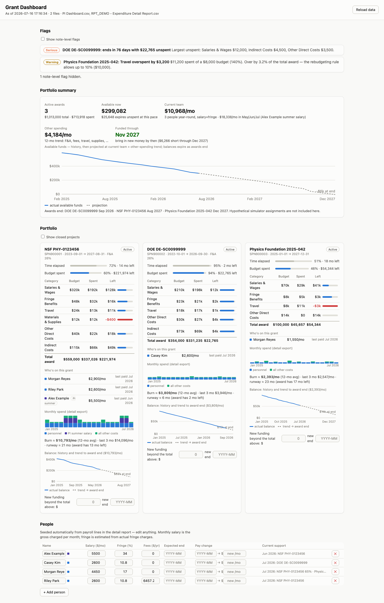

# UTKGrantDashboard

A **local-only** budget dashboard for PIs. It reads the CSV exports you can
already pull from the university reporting system, and gives you:

* **Portfolio view** — every award with budget vs. spent vs. remaining by
  category, spending pace vs. time elapsed, monthly burn rate, and runway.
* **Automatic flags** — overspent categories, charges against $0 budget
  lines, awards ending soon with money unspent, on-pace-to-overrun warnings.
* **Late-renewal tolerance** — a grant doled out year by year can look
  closed in the exports while the next increment is late. One tick ("Treat
  as active", on its card or right from the portfolio summary's "not in
  this summary — why?" list) keeps it in the summary and projections, with
  an editable expected end date.
* **Charge lookup** — pick one or more awards (SPNs) and a date window and
  see every transaction that posted to them: a month-by-month grid per
  expenditure type where a charge you expected but don't see stands out as a
  gap, plus the full searchable line-by-line list with transaction numbers,
  each line's description (the expense report comment, so you can see what a
  trip was for), and the vendor.
* **Hiring & departure planning in the People table** — people are seeded
  automatically from the payroll lines in your detail export, with their
  real salaries, fringe rates, and support splits. Add a person and pick
  their grant to model a hire, split anyone across grants with **+ split**
  (a payroll split can be edited into a what-if — move a student to
  another award, or 50/50 them — and reset); set an expected end date for
  a graduation, or a scheduled pay change — every edit flows straight into
  the projections (salary + fringe + fees + the F&A each award charges).



*(Fictional demo data — regenerate this view with
`python3 demo/make_demo_data.py && python3 dashboard.py --data demo/data`.)*

## Security model

This is the part to check before trusting it with financial data:

* `python3 dashboard.py` starts a web server bound **strictly to 127.0.0.1**
  — it is only reachable from your own machine, and it refuses any request
  that arrives from another page or hostname, so a website you happen to
  have open cannot talk to it.
* The tool makes **zero outbound network requests**. No CDN scripts, no
  fonts, no analytics. Turn wifi off and it works identically. The
  download links under **Get fresh data** are composed as text
  (`spn_reports.py`); clicking one is *your browser* fetching from the
  university's reporting system, exactly as if you had typed the URL.
* Your CSVs live in the `data/` folder, which is **.gitignore'd** — they
  cannot be committed or pushed by accident. The repo contains only code.
* The only folder outside `data/` that the dashboard touches is your
  **Downloads folder**: it lists the CSVs there that it recognizes as
  exports, so a fresh download can be copied into `data/` on a click.
  Nothing else is read, and nothing is ever deleted or moved. Start with
  `--no-inbox` to switch that off entirely.
* No dependencies to install: Python 3.9+ standard library only
  (macOS ships with this). The whole tool is a few files of readable
  Python/JS — audit it yourself.

## Quick start

1. Clone this repo (or download it).
2. Put your CSV exports in the `data/` folder (see below).
3. Run:

   ```
   python3 dashboard.py
   ```

   or double-click `Start Dashboard.command` (Mac) / `Start Dashboard.bat`
   (Windows). Your browser opens to `http://127.0.0.1:8787`.

4. When you have fresh exports, drop them in `data/` and click
   **Reload data** in the page header. A big detail export takes a while
   to read; the header shows which file is being read and how far along
   it is, and a reload that brings no new detail export is instant (each
   detail file is parsed once and remembered).

Looking after several PIs' grants — a business office, a department
manager? See [Several PIs on one machine](#several-pis-on-one-machine):
each PI gets a folder inside `data/` and the header grows a PI menu.

### Windows, without a terminal

For a business office on Windows machines, this is the whole setup:

1. **Install Python 3** once, from
   [python.org/downloads/windows](https://www.python.org/downloads/windows/).
   On the installer's first screen tick **Add python.exe to PATH**, then
   *Install Now*. (Nothing else gets installed, ever — the dashboard uses
   only Python's standard library.)
2. **Download this repo** with the green **Code ▾ → Download ZIP** button
   on GitHub, and extract the ZIP somewhere handy (Desktop, Documents).
   Extract it — don't run from inside the ZIP window.
3. Put the CSV exports in the `data` folder inside it.
4. **Double-click `Start Dashboard.bat`.** A small black window stays
   open while the dashboard runs, and your browser opens to the page.
   Close that window (or press Ctrl-C in it) to stop.

Notes:

* The first time, Windows may ask whether to run a file downloaded from
  the internet; it is a plain batch file (open it in Notepad to read the
  dozen lines), so choose *Run*, or *More info → Run anyway*.
* If Python isn't installed the window says so and opens the download
  page for you.
* The *Get fresh data* section works the same way as on a Mac: the
  dashboard looks in your Downloads folder for fresh exports (it finds
  the folder even when OneDrive or a policy has moved it) and copies them
  into `data` on a click.
* To get updates later, download the ZIP again and copy your `data`
  folder into the new one.

## Getting the data

Two reports feed the dashboard. Any filename ending in `.csv` works — the
tool identifies each file by its columns, so don't worry about renaming.

**The short version:** open **Get fresh data** in the dashboard header. It
builds a link that downloads the detail report for your projects in one
click, and imports the file into `data/` when it lands. The instructions
below explain what that link does, and how to get the same result by hand.

### 1. PI Dashboard export — required

This is the budget-vs-actuals summary (one row per project × expenditure
category). It provides the **budgets, remaining balances, and committed
costs** — without it there are no award cards, no flags, and nothing for
projections to anchor to.

1. Open the [PI Dashboard](https://oaxfdiprod-idabxacptyfb-ia.analytics.ocp.oraclecloud.com/ui/dv/?pageid=visualAnalyzer&reportmode=full&reportpath=%2F%40Catalog%2Fshared%2FUT%2FFIN%2FPI%2FPI%20Dashboard)
   in Oracle Analytics.
2. Navigate to **Project Summary**.
3. Enter your name in **Project PI / Manager**.
4. Export the Project Summary table as **CSV** and drop it in `data/`.

### 2. Expenditure detail report — strongly recommended

This is the transaction-level report (in Oracle BI Publisher; the report
number changes from time to time, but the export filename always starts
with `RPT`). It provides **monthly burn rates and spending history,
everyone paid from each award (with salaries and fringe rates that seed
hire planning), support splits, and exact F&A rates**. Without it
the dashboard still works, but falls back to linear burn estimates and an
empty People section.

You don't have to click through the report UI for this one. In the
dashboard, open **Get fresh data** (button in the header):

1. Log into the reporting system in any tab — the link below rides on that
   session.
2. Tick the awards you want (all of them, by default) and check the date
   window. It starts at your oldest award and runs through today; wider is
   better, since burn rates and seasonality come from this history.
3. Click **Download detail report CSV**. The reporting system streams the
   CSV straight to your Downloads folder.
4. The dashboard notices the new file and imports it into `data/` for you
   (untick *Import new exports automatically* if you'd rather press the
   Import button yourself).

If nothing downloads, expand *Nothing downloaded, or using Safari?*: it
gives you the raw URL to paste into the logged-in tab's address bar, and a
bookmarklet you can drag onto the Favorites bar and click from inside the
reporting system — which is the reliable route in Safari, where a link from
another page can be stripped of the session. That panel also holds the
report's layout name (`RPT07`): if a link opens the report viewer instead
of downloading a file, the layout has been renamed, and this is the field
to correct.

Same thing from a terminal, without the dashboard:

```
python3 spn_reports.py SPN107048 SPN107049 --from 2025-01-01 --open
python3 spn_reports.py --from-data data --open      # projects from your exports
python3 spn_reports.py --from-data data --installer install.html   # bookmarklet
```

Or do it by hand: open the [expenditure detail report](https://fa-ewlq-saasfaprod1.fa.ocs.oraclecloud.com/analytics/saw.dll?bipublisherEntry&Action=open&itemType=.xdo&bipPath=%2FCustom%2FProjects%2FSponsored%20Projects%2FRPT_GMS_007%20-%20Sponsored%20Project%20Detail%20Report.xdo&path=%2Fshared%2FCustom%2FProjects%2FSponsored%20Projects%2FRPT_GMS_007%20-%20Sponsored%20Project%20Detail%20Report.xdo)
in Oracle BI Publisher (if the link goes stale, search for the current
"Sponsored Project Detail Report"), enter all of your `SPN…` numbers and
the widest date range available, then export to **CSV** and drop it in
`data/`.

Moved to a different institution's reporting system, or had the report
renamed under you? Everything about where the report lives — host, catalog
path, layout name, parameter names, date format — is in the defaults at the
top of `spn_reports.py`, and any of it can be overridden per-machine by
dropping a `data/report_source.json` like `{"template": "RPT7"}`.

Notes:

* Multiple detail-report files are fine (e.g., one per account, or overlapping date
  ranges) — they merge and de-duplicate automatically. For PI Dashboard
  files, the newest file wins per project.
* Re-export both whenever you want fresh numbers (monthly is plenty) and
  click **Reload data** in the page header. Old files can stay in `data/`.
* Don't worry that the detail export is huge (hundreds of MB) — the reporting
  tool pads it heavily. Parsing takes a while, once, per new file; while it
  runs the header says which file is being read and how far along it is,
  and the Reload button waits (a second click doesn't start a second
  parse). A reload that only picks up a new PI Dashboard export is
  instant, since detail files already read are remembered.

## Several PIs on one machine

A PI keeps their two exports straight in `data/` and never needs any of
this. Someone who looks after several PIs gives each one a folder inside
`data/` — `data/Holmes/`, `data/Doe, Jane/` — and each folder is a complete
dashboard of its own: that PI's exports, their People table, their
scenarios and overrides (`config.json`), all separate.

* **Creating a folder:** open **Get fresh data** and click **+ New PI
  folder** (or make the folder in Finder/Explorer). The header then shows a
  **PI** menu listing every folder; the menu switches the whole page,
  including *Get fresh data*, to that PI. The page's address carries the
  choice (`?pi=Holmes`), so a browser tab per PI works too.
* **Getting a PI's exports in:** switch to their folder first. Step 1
  opens the PI Dashboard where you enter *that* PI's name; step 2's
  download link covers the projects in that folder; step 3 imports the
  download into that folder. Nothing is ever moved between folders, and
  `data/config.json`-style scenario edits save into the PI's folder.
* **Whose file is this?** The Downloads folder is shared, and the
  reporting system names every export the same way. Step 3 reads the PI
  name inside a PI Dashboard export, and the project numbers inside a
  detail export, and matches them against what each PI folder already
  holds: a file that belongs to another PI is labelled *looks like
  Lee's* with an **Import into data/Lee** button, is never imported
  automatically into the wrong folder, and a file already sitting in
  another folder says so.
* `report_source.json` in `data/` applies to every PI folder; one inside
  a PI's folder overrides it for that PI alone.
* The `data/` folder itself can still hold exports (they appear in the PI
  menu as *data/ itself*), which is what happens when a PI adds a
  colleague's folder next to their own files.

Parsed exports stay in memory for the three folders looked at most
recently, so switching back and forth is quick without holding every
PI's detail export at once.

## Notes on the numbers

* The detail report is exported by the reporting tool as a cartesian
  product of labor × non-labor lines; the parser de-duplicates each side
  and validates against the report's own totals.
* Line-item overruns are graded against the rebudgeting rule that any
  line may deviate by up to **10% of the total award**: a flag is only
  critical when that allowance is exhausted, and small overruns show as
  notes. Exception: fringe charging far above the budgeted fringe rate is
  always critical, since it usually signals a charging error that grows
  with every payroll.
* Burn rate prefers a 12-month average (capturing seasonality like summer
  salary), falling back to the last 3 active months, then to a linear
  average over the award period.
* Projection cost model per person: `salary × (1 + fringe) × support share
  × (1 + that award's F&A)`, plus their fees/tuition — which are excluded
  from the F&A base (MTDC). The F&A rate comes from the detail export
  (estimated from the budget where absent).
* Projected salaries escalate each **August** (defaults: UT 3%, GRA 5%)
  and fees/tuition at 2%/yr — rates editable under the People table. A
  scheduled pay change is taken at face value for its month and escalates
  from there.
* A person's cost is charged to awards by their **support split**: payroll's
  latest month by default, or whatever you enter in the People table. Shares
  below 100% in total mean the rest of their salary comes from elsewhere
  (a half-time appointment, a departmental TA line); over 100% is flagged.
* You can layer in things the reporting system doesn't know yet, and they
  feed the portfolio summary's funded-through projection: **expected new
  funding** per award (on its card, with the expected new end date —
  existing balance carries to the new end), an **expected end date** per
  person (graduation / rotating off your funding), and a scheduled **pay
  change** per person ("from month X, salary becomes $Y").
* Amount boxes accept what you paste (`$12,500`, `12,500.50`) and quick
  math (`5200/2` to put a student on a grant at 50%, `2600*1.03`). A box
  turns red when it can't read its contents, and the stored value is left
  alone until it can.
* Scenario edits (people, assignments, expectations, overrides) save to
  `data/config.json` — local and git-ignored, like everything else in
  `data/`.

## If you change the code

```
python3 -m unittest discover tests
```

Covers the download-link plumbing (URL shape, date formats, project-number
parsing, the bookmarklet, and the import endpoints) — the parts where a
quiet mistake means a CSV full of zeros — plus the charge lookup, the
reload cache (each detail file parsed once, one build at a time, progress
reported meanwhile) and the PI folders (a `?pi=` name can never reach
outside `data/`; imports and saved scenarios stay in their PI's folder).

## Sharing with a colleague

Point them at this repo. They clone it, export their own two reports into
`data/`, and run the same command. Nothing about your data travels with the
repo.

## Adapting this for another institution

Faculty elsewhere won't have these exact exports, but they can build the
same product tailored to whatever their institution exports. This repo
ships a skill for exactly that:
[`.claude/skills/build-pi-budget-dashboard/SKILL.md`](.claude/skills/build-pi-budget-dashboard/SKILL.md)
— it walks an AI coding assistant (e.g. Claude Code) through the process:
inventorying what the institution can export, inspecting the files'
quirks, learning the local rules (rebudgeting allowances, fringe rates,
summer salary, F&A), and building/verifying each feature, with this
codebase as the reference implementation.

To use it: clone this repo and open it in Claude Code (the skill loads
automatically), or copy the skill folder into your own project's
`.claude/skills/` — then ask for a dashboard built from your sample
exports.
